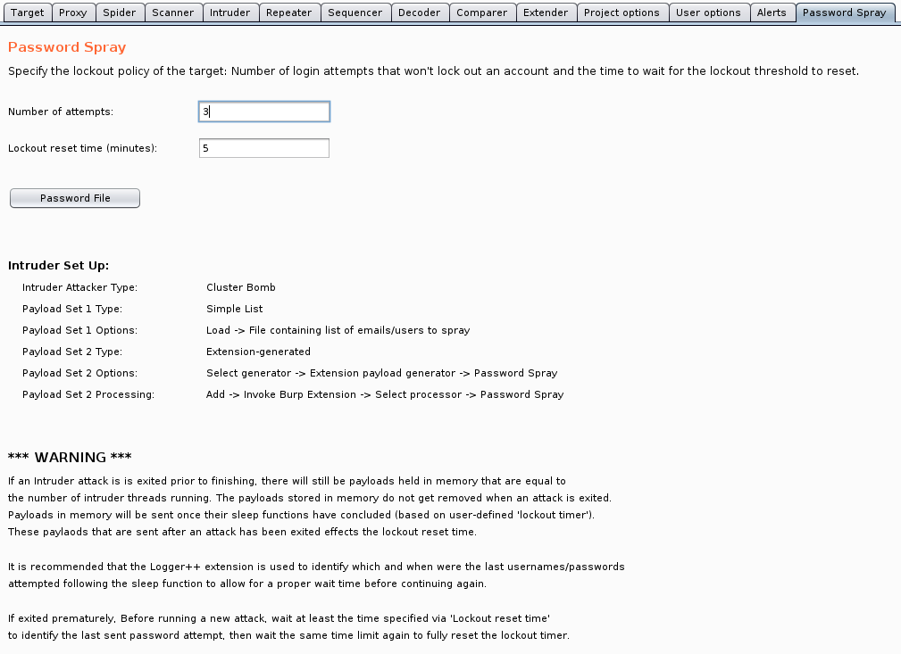

# Burp Password Spray
Burp Suite Password Spray Extension

This extension allows a user to specify a lockout policy in order to automate a password spray attack via Intruder.

### WARNING
> If an Intruder attack is is exited prior to finishing, there will still be payloads held in memory that are equal to the number of intruder threads running. The payloads stored in memory do not get removed when an attack is exited. Payloads in memory will be sent once their sleep functions have concluded (based on user-defined \'lockout timer\'). These paylaods that are sent after an attack has been exited effects the lockout reset time.

> It is recommended that the Logger++ extension is used to identify which and when were the last usernames/passwords attempted following the sleep function to allow for a proper wait time before continuing again.

> If exited prematurely, Before running a new attack, wait at least the time specified via \'Lockout reset time\' to identify the last sent password attempt, then wait the same time limit again to fully reset the lockout timer.

### Usage

#### Intruder Set Up
```
Intruder Attacker Type:
    Cluster Bomb

Payload Set 1 Type:
    Simple List

Payload Set 1 Options:
    Load -> File containing list of emails/users to spray

Payload Set 2 Type:
    Extension-generated

Payload Set 2 Options:
    Select generator -> Extension payload generator -> Password Spray

Payload Set 2 Processing:
    Add -> Invoke Burp Extension -> Select processor -> Password Spray
```

### TODO
* Research if preventing payloads from being stored in thread memory during sleep is possible